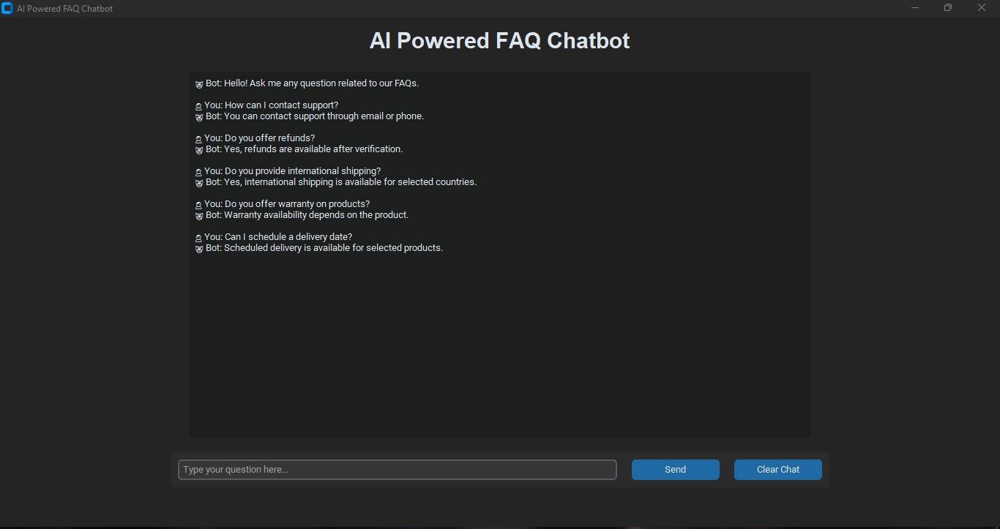

# 🤖 🤖 AI-Powered FAQ Chatbot

<p >
  <b>An Intelligent FAQ Assistant powered by NLP, TF-IDF Vectorization, and Cosine Similarity.</b>
</p>

<p >
  Answer customer queries instantly through semantic question matching and an interactive desktop interface.
</p>

---

## 🌟 Overview

Traditional FAQ systems rely on exact keyword matching, often failing when users phrase questions differently.

This project solves that problem by leveraging **Natural Language Processing (NLP)** techniques to understand user intent and retrieve the most relevant answer from a predefined FAQ knowledge base.

The chatbot converts questions into numerical vectors using **TF-IDF Vectorization** and identifies the closest matching FAQ using **Cosine Similarity**.

---

## ✨ Key Features

🔹 Intelligent question-answer matching

🔹 Interactive GUI built with CustomTkinter

🔹 NLP-based response retrieval

🔹 Real-time user interaction

🔹 JSON-powered FAQ database

🔹 Handles differently phrased questions

🔹 Lightweight and easy to deploy

---

## 🧠 How It Works

```text
User Question
      │
      ▼
TF-IDF Vectorization
      │
      ▼
Cosine Similarity Calculation
      │
      ▼
Best Matching FAQ
      │
      ▼
Response Displayed
```

---

## 🛠️ Technology Stack

| Technology        | Purpose                   |
| ----------------- | ------------------------- |
| Python            | Core Programming          |
| CustomTkinter     | Modern GUI Development    |
| Scikit-Learn      | NLP & Similarity Matching |
| JSON              | FAQ Knowledge Base        |
| TF-IDF            | Text Vectorization        |
| Cosine Similarity | Question Matching         |

---

## 📂 Project Structure

```text
ai-faq-chatbot/
│
├── faq_chatbot.py
├── faq_data.json
├── requirements.txt
├── chatbot-demo.png
└── README.md
```

---

## 🚀 Installation

Clone the repository:

```bash
git clone https://github.com/Madhura-Malap/ai-faq-chatbot.git
```

Install required packages:

```bash
pip install -r requirements.txt
```

Run the application:

```bash
python faq_chatbot.py
```

---

## 🎯 Sample Queries

✔ How can I contact support?

✔ Do you offer refunds?

✔ Can I track my order?

✔ Is cash on delivery available?

✔ How do I reset my password?

---

## 📸 Live Demonstration



---

## 🔮 Future Enhancements

🚀 Voice-based interaction

🚀 Multi-language support

🚀 Database integration

🚀 OpenAI/Gemini integration

🚀 Web deployment using Streamlit

🚀 Context-aware conversations

---

## 💡 Learning Outcomes

Through this project, I gained hands-on experience with:

* Natural Language Processing (NLP)
* TF-IDF Vectorization
* Cosine Similarity
* Information Retrieval Systems
* Python GUI Development
* JSON Data Handling

---

## 👩‍💻 Author

### Madhura Malap

Computer Science Engineering Student
Aspiring AI/ML Engineer
